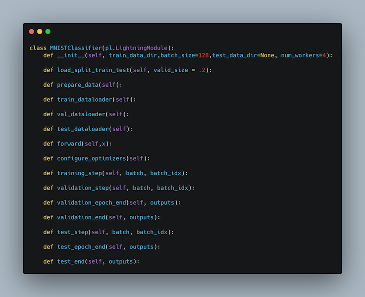
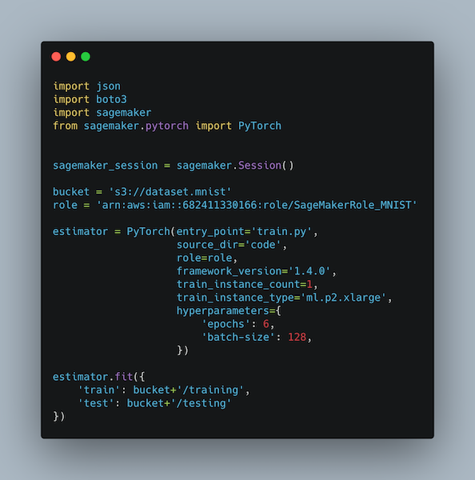
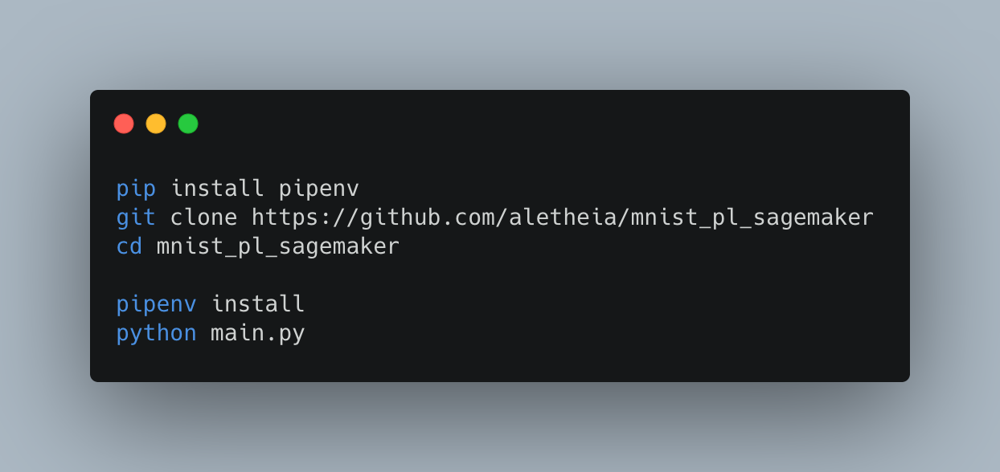

# Neural Networks on Amazon SageMaker with PyTorch Lightning

This is an example project showing how you could use Amazon SageMaker with Pytorch Lightning, from getting started to model training. 
A detailed discussion about SageMaker and PyTorch Lightning can be found in the article [**Neural Network on Amazon SageMaker with PyTorch Lightning**](https://medium.com/@aletheia/machine-learning-model-development-on-amazon-sagemaker-with-pytorch-lightning-63730ec740ea).

### PyTorch Lightning
The super cool [Pytorch Lightning Framework](https://github.com/PyTorchLightning/pytorch-lightning) to simplify machine learning model development. 

Pytorch Lightning (PL) offers support to a wide number of advanced functions to ML researchers developing models. It is also useful when managing multiple projects because imposes a defined structure:

### Amazon SageMaker
Amazon SageMaker offers suport to model training and instance management through a number of features exposed to developers and researched. One of the most interesting feature is its capability of managing GPU instances on your behalf, through Python CLI:

### Running this code
The conde contained in this repo can be run either using SageMaker Notebook Instances and from a standard Python project. I personally prefer the latter approach because it does not require any Jupyter Notebook instance to be set up and configured and has the improved capability to create computation resources when they are needed and destroy them after usage, in a Serverless compliant way.

#### Run on SageMaker
To run this project on Amazon SageMaker, please spin up your Amazon SageMaker Notebook, attach a github repository, then run **notebook/sagemaker_deploy.ipynb**

#### Run using Python
To run the project using Python

## Credits
This project uses [SageMaker Execution Role creation](https://medium.com/ml-bytes/how-to-a-create-a-sagemaker-execution-role-539866910bda) script by [Márcio Dos Santos](https://medium.com/@marcio_santos?source=post_page-----539866910bda----------------------)

## License
This project is released under [MIT](./LICENSE) license. Feel free to download, change and distribute the code published here.